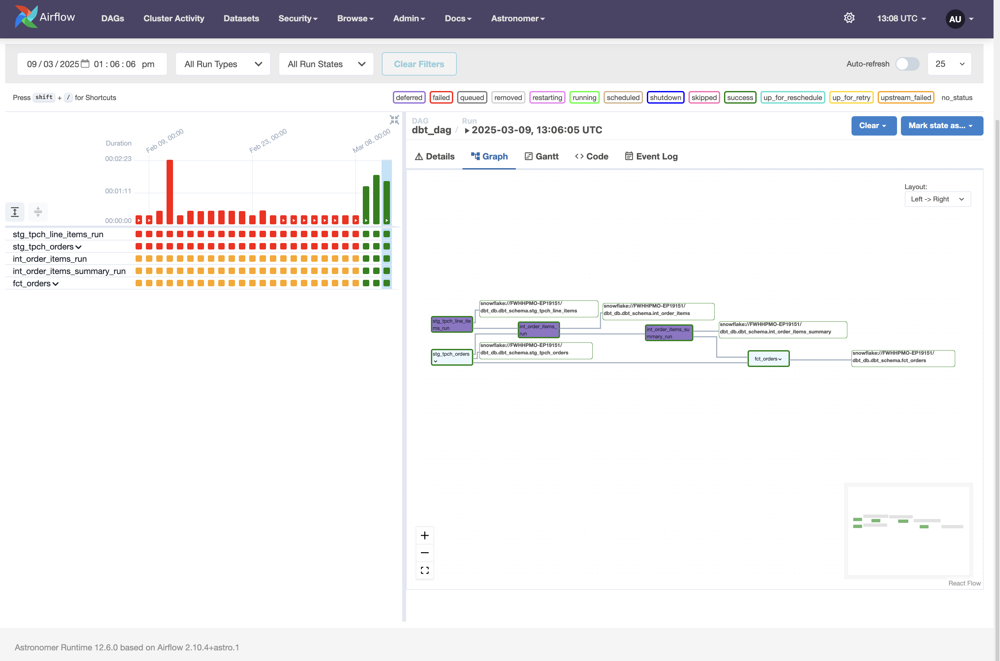

# ELT Data Pipeline with dbt, snowflake and Airflow

This ELT project involved extracting and loading sample datasets into Snowflake. I materialized my original/raw data as a view in the staging folder, optimizing storage since views do not physically store data. To enforce referential integrity, I utilized dbt's built-in function to create a surrogate key.

For transformation, I created two intermediary (Int) tables where I performed aggregations and joins. These tables sit between the staging models and the final fact tables.

Instead of writing one large SQL query, Int tables help break down my queries into smaller, modular models. They pre-compute expensive joins, calculations, and aggregations before being used in the final fact table.

I also created a macro to calculate the discounted amount and discount percentage. Macros help eliminate redundant SQL logic and allow updates to be made in a single place rather than across multiple models.

Both singular and generic tests were implemented to validate data quality. A singular test ensures that order dates fall within an acceptable range, while generic tests leverage dbt's built-in functions to check for uniqueness, null values, and referential integrity constraints on foreign keys.

Finally, Apache Airflow was used to automate the pipeline.

## Project Screen Shot(s)



---

## Project Structure
```plaintext
.
├── models/
│   ├── marts/          # Business-ready models (fact and dimension tables)
│   │   ├── fct_orders.sql
│   │   ├── int_order_items.sql
│   │   └── int_order_items_summary.sql
│   │   └── generic_tests.yml
│   ├── staging/        # Source-aligned staging models
│   │   ├── stg_tpch_line_items.sql
│   │   ├── stg_tpch_orders.sql
│   │   └── tpch_sources.yml
│   └── macros/         # Reusable functions and utilities
│       └── pricing.sql
```

# Project Setup Instructions  

## 1️⃣ Prerequisites  
Make sure you have the following libraries installed in your virtual environment:  
- **[Astronomer](https://www.astronomer.io/)** (for Airflow orchestration)  
- **[dbt](https://www.getdbt.com/)** (for data transformations)  
- **[Snowflake Connector](https://docs.snowflake.com/en/user-guide/python-connector)** (for database connection)
  
## 2️⃣ Setup Snowflake Online
```sql
  -- create accounts
use role accountadmin;

create warehouse dbt_wh with warehouse_size='x-small';
create database if not exists dbt_db;
create role if not exists dbt_role;

show grants on warehouse dbt_wh;

grant role dbt_role to user <username> ;
grant usage on warehouse dbt_wh to role dbt_role;
grant all on database dbt_db to role dbt_role;

use role dbt_role;

create schema if not exists dbt_db.dbt_schema;

-- clean up
use role accountadmin;

drop warehouse if exists dbt_wh;
drop database if exists dbt_db;
drop role if exists dbt_role;
```

## 3️⃣ Clone the Repository  
```bash
git clone <repository-url>
cd <project-folder>
```
## 4️⃣ Configure Snowflake Connection
Since this project uses Snowflake:

Create a profiles.yml file (if not already present):
Location: ~/.dbt/profiles.yml
```bash
Add your Snowflake credentials:
snowflake_project:
  target: dev
  outputs:
    dev:
      type: snowflake
      account: <your_account>
      user: <your_username>
      password: <your_password>
      role: <your_role>
      database: <your_database>
      warehouse: <your_warehouse>
      schema: <your_schema>
      threads: 10
      client_session_keep_alive: false
```

## 5️⃣ Set up Astronomer (Airflow) 
### Initialise your airflow project
```bash
astro dev init
```
### Start Airflow locally 
```bash
Astro dev start
```
- Default credentials (Username - admin, Password admin)
- In the airflow UI, find dbt_dag 
- Trigger the DAG manually 
- Monitor the task execution and check logs for debugging if needed

Your data pipeline is now set up, extracting data from snowflake, transforming it with dbt, and orchestrating workflows using airflow via Astronomer

---
